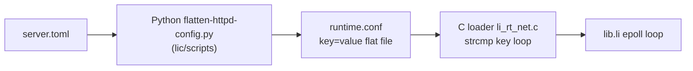
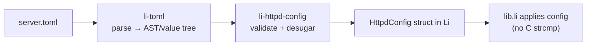

# Li-native TOML + httpd config migration (2026-06)

## Goal

Replace the Python `flatten-httpd-config.py` pipeline and the legacy C `runtime.conf` loader with a **Li-only** pipeline:

- **`li-toml`**: Li-native TOML parser (generic `TomlDoc` / `TomlValue` tree)
- **`li-httpd`**: config desugar/validate/apply (httpd-specific)
- **benchmarks**: harness flag to select pipeline (`LI_HTTPD_CONFIG_PIPELINE`, default `python` during the transition)

## Repo roles / branches

| Repo | Branch | Role |
|------|--------|------|
| `li-toml` | `cursor/li-toml-config-migration` | TOML parser (Li only) |
| `li-httpd` | `cursor/li-toml-config-migration` | Config desugar, gates, apply |
| `benchmarks` | `feat/li-toml-config-pipeline` | Harness flag + parity wiring |
| `lic` | *(no feature work)* | Pin only in `li-toolchain.toml` |

## Phase loop contract

The current phase is tracked in `data/li-toml-config-loop/state.json`.

Rules per iteration:

- Implement **only** the active phase.
- Run that phase’s gate script.
- Append one row to `data/li-toml-config-loop/iteration-log.md`.

## Phases (high level)

| Phase | Key | Deliverable | Gate |
|------:|-----|-------------|------|
| 0 | `phase-0-prep` | repo scaffolds + corpus wiring + benchmarks flag | `bash scripts/gates/phase-0-prep-gate.sh` |
| A0 | `phase-a0-parse` | `li-toml` parses `li-tests/config/good/*.toml` | `bash scripts/gates/phase-a0-parse-gate.sh` |
| B1 | `phase-b1-parity` | Li flatten byte-parity vs Python on good corpus; reject corpus fails | `bash scripts/gates/phase-b1-parity-gate.sh` |
| B2 | `phase-b2-serve` | `li-httpd serve server.toml`; tier5 smoke with `LI_HTTPD_CONFIG_PIPELINE=li` | `bash scripts/gates/phase-b2-serve-gate.sh` |
| C | `phase-c-retire-c` | Config applied in Li; no new C config keys | `bash scripts/gates/phase-c-retire-c-gate.sh` |
| D | `phase-d-done` | Harness defaults to `pipeline=li`; Python flatten deprecated | `bash scripts/gates/li-toml-config-completion-gate.sh` |

# Plan: Li-native TOML parser + httpd config migration

**Status:** draft  
**Owner:** li-httpd + li-toml (new)  
**Principle:** lic = compiler only. Parser, desugar, validation, and runtime config application are **Li** in ecosystem repos. Benchmarks must stay green at every phase.

---

## 1. Problem today



| Layer | Location | Issue |
|-------|----------|--------|
| TOML parse + validate | `lic/scripts/httpd_config.py`, `validate-httpd-config.py`, `httpd_m2.py`, `httpd_m3.py`, `httpd_tls.py`, … | Python, lives in compiler repo |
| Desugar → flat conf | `lic/scripts/flatten-httpd-config.py` (~250 LOC) | Interim format, not typed |
| Load config | `httpd_load_runtime_config_i` in **C** (~40 keys) | Violates “Li only” for httpd |
| Harness / benchmarks | `benchmarks/harness/*`, tier5 `http_oracles.py` | Calls Python flatten or hand-writes `.conf` |
| Golden corpus | `lic/li-tests/config_desugar/{good,reject}/` (49 TOMLs) | Owned by lic today |

**Target:**



---

## 2. New repos & boundaries

| Repo | Responsibility | Must not |
|------|----------------|----------|
| **li-toml** | TOML 1.0 subset parser + lexer; generic `TomlDoc`, `TomlValue`; fuzz/smoke tests | Know about httpd |
| **li-httpd** | `HttpdConfig`, desugar, route tables, CLI `li-httpd serve config.toml` | Python, C config parsing |
| **li-httpd** (this repo) | Wire `HttpdConfig` into epoll/proxy/TLS loop | Add logic in lic |
| **lic** | Compiler; minimal syscall seam only | New httpd/toml Python or C |
| **benchmarks** | Harness; oracle parity during migration | Copy flatten into benchmarks permanently |

**Package names (proposed):**

- `import toml` from **li-toml** (`github_repo = "li-toml"`)
- `import net.httpd.config` or `import httpd.config` from **li-httpd** (`src/config.li`)

---

## 3. li-toml — parser design (phase A)

### 3.1 Scope (incremental TOML)

**MVP (phase A0):** enough for all `li-tests/config_desugar/good/*.toml`:

- `[table]` headers, `key = value`
- Strings (basic + triple-quoted later), integers, floats, booleans
- Inline tables `{ a = 1 }` — if present in corpus
- Array of strings (e.g. upstream peers)
- Comments `#`, newlines
- Dotted keys `server.listen` → equivalent table nesting

**Defer:** full Unicode escapes, datetime offsets, heterogeneous arrays, scientific notation edge cases (add when corpus needs them).

### 3.2 API (sketch)

```li
# li-toml/src/lib.li
def toml_parse(text: ptr, len: int) raises Parse -> TomlDoc
def toml_get_table(doc: TomlDoc, path: ptr) -> int   # slot or -1
def toml_get_string(doc: TomlDoc, table: int, key: ptr) -> ptr
def toml_get_int(doc: TomlDoc, table: int, key: ptr) -> int  # missing → sentinel
```

Implementation: hand-written lexer + recursive descent in **Li only** (no C). Bytes via `li-bytes` if needed.

### 3.3 Tests (li-toml)

| Suite | Purpose |
|-------|---------|
| `li-tests/smoke/parse_minimal.li` | empty doc, one table, one key |
| `li-tests/corpus/toml-spec/` | vendored minimal vectors (public domain snippets) |
| `li-tests/fuzz/` | optional later: libFuzzer via harness or structured mutations |
| **Parity gate** | For each `config_desugar/good/*.toml`, parse must succeed; for `reject/`, parse may succeed but httpd desugar must fail |

Parser tests do **not** require httpd.

---

## 4. li-httpd config layer (phase B)

### 4.1 Move corpus to li-httpd

Copy (then own):

- `li-tests/config_desugar/good/` → `li-httpd/li-tests/config/{good,reject}/`
- `*.explained.golden` → keep for explain-config parity or regenerate from Li

Stop adding fixtures under lic.

### 4.2 Desugar modules (replace Python)

| Python today | Li module (proposed) |
|--------------|---------------------|
| `httpd_config.py` orchestration | `config/load.li` |
| `httpd_tls.py` | `config/tls.li` |
| `httpd_m2.py` | `config/m2.li` |
| `httpd_m3.py` | `config/m3.li` |
| `httpd_m15.py` / leak censor | `config/m15.li` |
| `flatten-httpd-config.py` | `config/flatten.li` (temporary) or **skip flat file entirely** |

**Typed config:**

```li
struct HttpdConfig
  listen_port: int
  listen_port_http: int
  document_root: ptr
  tls: TlsConfig
  routes: RouteTable
  ...
```

Validation errors: structured `ConfigError` with path (`server.tls.mode`) — no stderr from Python.

### 4.3 Apply config in Li (retire C loader)

**Phase B1:** Li desugar → emit same `runtime.conf` bytes as Python → existing C loader unchanged.  
**Phase B2:** Li calls setters (`httpd_config_apply_i(cfg)`) — one C struct fill from Li, or pure Li globals.  
**Phase B3:** Delete C `strcmp` loop; config lives only in Li memory.

Rule: **no new keys added to C loader** after B1 starts; new keys Li-only.

---

## 5. Benchmark continuity strategy

Benchmarks must not break during multi-month migration.

### 5.1 Golden parity oracle (primary gate)

Add **`li-httpd/scripts/config-parity-check`** (Li binary or `lic run`):

```
For each good/*.toml:
  flat_py  = python flatten (legacy, pinned script hash optional)
  flat_li  = li-httpd config flatten (Li)
  assert normalize(flat_py) == normalize(flat_li)
For each reject/*.toml:
  assert Li desugar fails
  assert Python desugar fails (while legacy exists)
```

Run in:

- **li-httpd CI** (every PR)
- **benchmarks** nightly preflight (`BENCH_CONFIG_PARITY=1`) optional week 1+

### 5.2 Harness dual path (transition)

| Env | Behavior |
|-----|----------|
| `LI_HTTPD_CONFIG_PIPELINE=python` (default until cutover) | Current: flatten via lic Python |
| `LI_HTTPD_CONFIG_PIPELINE=li` | `li-httpd config flatten` or in-process |
| `LI_HTTPD_CONFIG_PIPELINE=dual` | Both; fail on mismatch; use python for serve (early) → use li (late) |

Update:

- `benchmarks/harness/http_bench_servers.py`
- `benchmarks/vendor/lis-tier5/.../http_oracles.py` (`write_li_tls_runtime_conf` → call Li flatten or build struct in harness)

**Tier5 matrix rows unchanged** — same scenarios, same CSV schema; only config generation path changes.

### 5.3 Benchmark tiers during migration

| Gate | When | Command |
|------|------|---------|
| **G0 — parity** | Every li-httpd PR | `config-parity-check` on full corpus |
| **G1 — smoke** | Every li-httpd PR | `dual_listen_smoke`, one tier5 scenario |
| **G2 — tier5 subset** | Weekly / pre-merge | `https_tls_matrix` + `exploit_http --profile pr` |
| **G3 — full nightly** | benchmarks main | Full tier5 + weaponized |

**Rollback:** flip `LI_HTTPD_CONFIG_PIPELINE=python` in benchmarks workflow env.

### 5.4 Performance benchmarks

TOML parse + desugar time is **not** in hot path (once at startup). No wrk/TLS handshake regression expected. Optional micro-bench row in `catalog.toml`: `httpd_config_desugar_us` — track parse+desugar ms for `agent_gateway.toml`.

---

## 6. Phased timeline

### Phase 0 — Prep (1 week)

- [ ] Create **li-toml** repo; scaffold `lic check` CI with lic pin
- [ ] Move `config_desugar` corpus to **li-httpd** (copy; lic marks read-only)
- [ ] Document env flags in benchmarks README
- [ ] Add `LI_HTTPD_CONFIG_PIPELINE` to tier5 harness (still `python` only)

### Phase A — li-toml MVP (2–3 weeks)

- [ ] Lexer + parser; parse all **good** corpus files
- [ ] Unit tests + 20+ spec microcases
- [ ] Publish li-toml `0.1.0`; pin in li-httpd `li.toml`

### Phase B1 — Li desugar + flat parity (3–4 weeks)

- [ ] `config/flatten.li` produces byte-identical `.conf` vs Python (normalized line order)
- [ ] Port validation rules from `httpd_config.py` / reject corpus
- [ ] CLI: `li-httpd config flatten -o runtime.conf server.toml`
- [ ] Gate G0 green; harness supports `pipeline=li` for flatten-only

### Phase B2 — Direct TOML serve (2 weeks)

- [ ] `li-httpd serve server.toml` — parse + desugar in Li, write temp conf or apply struct
- [ ] tier5 oracles use Li flatten; matrix G2 green
- [ ] Deprecate Python flatten in docs

### Phase C — Retire C config loader (4–6 weeks, parallel with seam migration)

- [ ] `httpd_apply_config(cfg: HttpdConfig)` in Li
- [ ] Shrink C to memcpy from Li blob or field-at-a-time setters (last C touch)
- [ ] Remove `httpd_load_runtime_config_i` path from `main.li`
- [ ] Delete Python scripts from **li-httpd** vendor mirror; lic scripts frozen/archived

### Phase D — Cleanup (1 week)

- [ ] benchmarks default `LI_HTTPD_CONFIG_PIPELINE=li`
- [ ] Remove Python flatten from harness
- [ ] lic: delete or stub `flatten-httpd-config.py` with “use li-httpd” message

---

## 7. Work split (who owns what)

| Task | Repo |
|------|------|
| TOML lexer/parser | **li-toml** |
| Httpd schema + desugar | **li-httpd** |
| CLI `serve` / `config flatten` | **li-httpd** |
| Config apply in server loop | **li-httpd** |
| Parity gate script | **li-httpd** (calls legacy Python via subprocess during B1 only) |
| Harness pipeline switch | **benchmarks** PR |
| Tier5 scenarios | unchanged |
| Compiler | **lic** — no config code |

---

## 8. Risks & mitigations

| Risk | Mitigation |
|------|------------|
| Subtle desugar mismatch breaks TLS bench | G0 parity on full corpus + dual pipeline in CI |
| TOML subset too small for real configs | Expand parser driven by corpus diffs, not spec upfront |
| C loader drift | Freeze new C keys at B1; lint in PR template |
| Two sources of truth during migration | Time-box B1; max 8 weeks dual pipeline |
| Exploit drivers read flat conf | `_driver_common.flatten_config` → Li CLI wrapper |

---

## 9. Success criteria

1. **All** `config/good/*.toml` parse + desugar in Li; **all** `reject/` fail with stable error codes.
2. Tier5 `https_tls_matrix` + `exploit_http --profile nightly` pass with `LI_HTTPD_CONFIG_PIPELINE=li`.
3. No Python and no new C in config path on li-httpd `main`.
4. `li-httpd serve examples/tls_h2.toml` works without intermediate `.conf` file (phase B2+).
5. Benchmarks dashboard needs no schema change — same metrics CSV columns.

---

## 10. Immediate next steps

1. Open **li-toml** repo; empty parser + CI.
2. PR to **li-httpd**: move `config_desugar` corpus + this plan.
3. PR to **benchmarks**: `LI_HTTPD_CONFIG_PIPELINE` env (no behavior change yet).
4. Implement parse-only for 3 fixtures: `agent_gateway.toml`, `tls_self_signed_dev.toml`, `tls_dual_listen.toml`.

---

## Appendix A — Config keys in C today (~40)

From `li_rt_net.c` loader (must be covered by `HttpdConfig` or removed):

`listen_port`, `listen_port_http`, `workers`, `document_root`, `proxy_all`, `upstream_peer`, `upstream_balance`, rate limits, health probes, auth, stream limits, TLS/M2/M3/M15/leak_censor, `model_match`, `route_require`, `route`, …

Appendix B — Python script LOC to port: ~750 total across flatten + validate + httpd_config orchestration.

Appendix C — Harness touch points:

- `benchmarks/harness/http_bench_servers.py`
- `benchmarks/harness/exploit_http.py`
- `benchmarks/benchmarks/workloads/tier5_http/drivers/_driver_common.py`
- `benchmarks/vendor/lis-tier5/benchmarks/tier5_http/harness/http_oracles.py`
